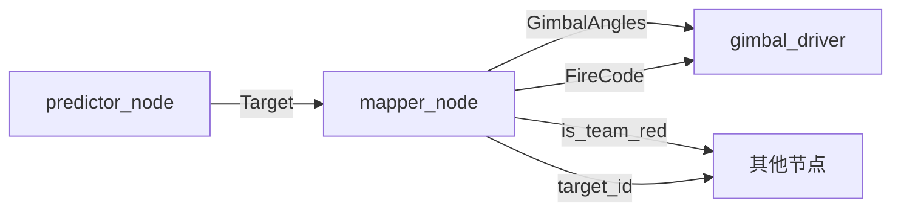
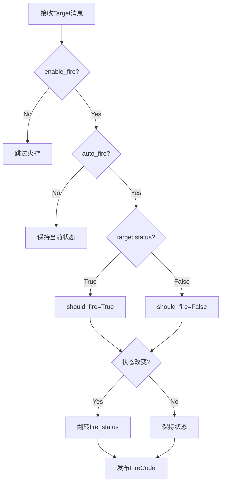

# mapper_node.py 火控功能改进计划

## 1. 需求分析

### 当前状态
[`mapper_node.py`](../../src/detector/script/mapper_node.py:1) 目前功能：
- 订阅 `/ly/predictor/target` 话题，接收目标信息
- 发布 `/ly/control/angles` 话题，映射云台角度
- 发布 `/ly/me/is_team_red` 话题，发布队伍颜色
- 发布 `/ly/bt/target` 话题，发布目标ID

### 缺失功能
- **火控命令发布**：缺少 `/ly/control/firecode` 话题的发布
- **火控状态管理**：缺少火控状态的跟踪和翻转逻辑
- **命令行参数控制**：需要支持通过命令行参数控制是否默认开火

## 2. 火控逻辑分析

### 参考实现：shooting_table_node.cpp

从 [`shooting_table_node.cpp`](../../src/shooting_table_calib/shooting_table_node.cpp:232) 中提取的核心火控逻辑：

```cpp
// 火控数据结构
struct FireControlData {
    uint8_t fire_status = 0;  // 只使用最低2位：00 或 11
    bool last_fire_command = false; 
} fire_control;

// 翻转火控状态（0b00 <-> 0b11）
void flipFireStatus() {
    fire_control.fire_status = (fire_control.fire_status == 0) ? 0b11 : 0b00;
}

// 更新火控命令
void updateFireControl(bool should_fire) {
    if (should_fire != fire_control.last_fire_command) {
        if (should_fire) {
            flipFireStatus();  // 开火时翻转状态
        }
        fire_control.last_fire_command = should_fire;
        sendFireControlCommand();
    }
}

// 发布火控命令
void sendFireControlCommand() {
    std_msgs::msg::UInt8 fire_msg;
    fire_msg.data = fire_control.fire_status;
    firecode_pub_->publish(fire_msg);
}
```

### FireCodeType 结构（来自 BasicTypes.hpp）

```cpp
struct FireCodeType {
    std::uint8_t FireStatus : 2 = 0;  // 开火状态：0b00 <-> 0b11
    std::uint8_t CapState : 2 = 0;    // 电容状态
    std::uint8_t HoleMode : 1 = 0;    // 钻洞模式
    std::uint8_t AimMode : 1 = 0;     // 瞄准模式
    std::uint8_t Rotate : 2 = 0;      // 小陀螺状态
    
    void FlipFireStatus() noexcept { 
        FireStatus = FireStatus == 0 ? 0b11 : 0b00; 
    }
};
```

### 关键要点

1. **火控状态编码**：使用 `uint8_t`，最低2位表示开火状态（`0b00` 或 `0b11`）
2. **状态翻转机制**：每次开火命令时需要翻转状态（0 ↔ 3），这是触发下位机开火的关键
3. **状态跟踪**：需要记录上一次的开火命令，避免重复发送相同状态
4. **话题名称**：`/ly/control/firecode`，消息类型：`std_msgs::msg::UInt8`

## 3. 改进方案设计

### 3.1 新增功能模块

#### 火控状态管理类
```python
class FireControl:
    """火控状态管理器"""
    def __init__(self):
        self.fire_status = 0  # 0b00 或 0b11
        self.last_fire_command = False
    
    def flip_status(self):
        """翻转火控状态"""
        self.fire_status = 0b11 if self.fire_status == 0 else 0b00
    
    def update(self, should_fire: bool) -> bool:
        """更新火控状态，返回是否需要发布"""
        if should_fire != self.last_fire_command:
            if should_fire:
                self.flip_status()
            self.last_fire_command = should_fire
            return True
        return False
```

#### 目标状态跟踪
- 监听 [`Target`](../../src/auto_aim_common/msg/Target.msg:1) 消息的 `status` 字段
- 当 `status=True` 时表示有目标，触发开火
- 当 `status=False` 时表示无目标，停止开火

### 3.2 命令行参数设计

新增参数：
- `--enable-fire`：是否启用火控功能（默认：`True`）
- `--auto-fire`：是否自动开火（默认：`True`）

参数组合逻辑：
- `--enable-fire=false`：完全禁用火控，不发布任何火控命令
- `--enable-fire=true --auto-fire=true`：根据目标状态自动开火（默认）
- `--enable-fire=true --auto-fire=false`：启用火控但不自动开火（手动控制）

### 3.3 消息流设计



### 3.4 火控逻辑流程



## 4. 实现步骤

### 步骤 1：添加火控发布者
在 [`TargetToGimbalNode.__init__()`](../../src/detector/script/mapper_node.py:10) 中添加：
```python
self.firecode_pub = self.create_publisher(UInt8, '/ly/control/firecode', 10)
```

### 步骤 2：添加火控状态管理
```python
# 火控状态
self.fire_control = {
    'fire_status': 0,
    'last_fire_command': False
}
self.enable_fire = enable_fire
self.auto_fire = auto_fire
```

### 步骤 3：修改 target_callback
在 [`target_callback()`](../../src/detector/script/mapper_node.py:42) 中添加火控逻辑：
```python
def target_callback(self, msg: Target):
    # 映射云台角度
    gimbal_msg = GimbalAngles()
    gimbal_msg.header = msg.header
    gimbal_msg.yaw = msg.yaw
    gimbal_msg.pitch = msg.pitch
    self.gimbal_pub.publish(gimbal_msg)
    
    # 火控逻辑
    if self.enable_fire and self.auto_fire:
        should_fire = msg.status  # 根据目标状态决定是否开火
        if should_fire != self.fire_control['last_fire_command']:
            if should_fire:
                # 翻转状态
                self.fire_control['fire_status'] = (
                    0b11 if self.fire_control['fire_status'] == 0 else 0b00
                )
            self.fire_control['last_fire_command'] = should_fire
            
            # 发布火控命令
            fire_msg = UInt8()
            fire_msg.data = self.fire_control['fire_status']
            self.firecode_pub.publish(fire_msg)
            
            self.get_logger().info(
                f'Fire control: {"FIRE" if should_fire else "STOP"} '
                f'(status=0b{self.fire_control["fire_status"]:08b})'
            )
```

### 步骤 4：添加命令行参数
在 [`main()`](../../src/detector/script/mapper_node.py:63) 中添加：
```python
parser.add_argument(
    '--enable-fire',
    type=lambda x: x.lower() in ('true', '1', 'yes'),
    default=True,
    help='是否启用火控功能 (默认: true)'
)
parser.add_argument(
    '--auto-fire',
    type=lambda x: x.lower() in ('true', '1', 'yes'),
    default=True,
    help='是否自动开火 (默认: true)'
)
```

### 步骤 5：更新节点初始化
```python
node = TargetToGimbalNode(
    is_red=cli_args.red,
    target_id=cli_args.target_id,
    enable_fire=cli_args.enable_fire,
    auto_fire=cli_args.auto_fire
)
```

## 5. 测试计划

### 5.1 单元测试场景

| 场景 | enable_fire | auto_fire | target.status | 预期行为 |
|------|-------------|-----------|---------------|----------|
| 1 | False | - | True | 不发布火控命令 |
| 2 | True | False | True | 不发布火控命令 |
| 3 | True | True | True | 发布开火命令（翻转状态） |
| 4 | True | True | False | 发布停火命令（保持状态） |
| 5 | True | True | True→True | 不重复发布 |
| 6 | True | True | False→False | 不重复发布 |

### 5.2 集成测试

1. **启动节点**：
   ```bash
   # 在工作区根目录执行，并先 source ROS2 + 工作区环境
   # 默认配置（启用火控，自动开火）
   python3 src/detector/script/mapper_node.py
   
   # 禁用火控
   python3 src/detector/script/mapper_node.py --enable-fire false
   
   # 启用火控但不自动开火
   python3 src/detector/script/mapper_node.py --auto-fire false
   ```

2. **监听话题**：
   ```bash
   ros2 topic echo /ly/control/firecode
   ```

3. **发布测试消息**：
   ```bash
   # 发布有目标的消息
   ros2 topic pub /ly/predictor/target auto_aim_common/msg/Target \
     "{status: true, yaw: 0.0, pitch: 0.0}"
   
   # 发布无目标的消息
   ros2 topic pub /ly/predictor/target auto_aim_common/msg/Target \
     "{status: false, yaw: 0.0, pitch: 0.0}"
   ```

4. **验证行为**：
   - 检查 `/ly/control/firecode` 话题是否正确发布
   - 验证状态翻转逻辑（0 ↔ 3）
   - 确认不会重复发送相同状态

### 5.3 边界条件测试

- 快速切换目标状态（True ↔ False）
- 长时间保持同一状态
- 节点重启后的状态初始化

## 6. 代码改进要点

### 6.1 最小化改动原则
- 保持现有功能不变
- 仅添加火控相关代码
- 不修改现有的角度映射逻辑

### 6.2 代码质量
- 添加详细的日志输出
- 使用清晰的变量命名
- 添加必要的注释说明火控逻辑

### 6.3 兼容性
- 保持与现有系统的兼容性
- 火控功能可通过参数完全禁用
- 不影响其他节点的正常运行

## 7. 部署建议

### 7.1 配置文件更新
如果使用 launch 文件，建议添加参数配置：
```python
from launch.actions import ExecuteProcess

# 在 launch 文件中（脚本方式）
ExecuteProcess(
    cmd=[
        'python3',
        'src/detector/script/mapper_node.py',
        '--enable-fire', 'true',
        '--auto-fire', 'true',
    ],
    output='screen'
)
```

### 7.2 文档更新
更新 [`mapper_node.py`](../../src/detector/script/mapper_node.py:1) 的文档字符串，说明：
- 新增的火控功能
- 命令行参数说明
- 火控逻辑的工作原理

## 8. 风险评估

### 8.1 潜在风险
- **误触发开火**：如果目标检测不稳定，可能导致频繁开火
- **状态不同步**：如果消息丢失，可能导致火控状态不一致

### 8.2 缓解措施
- 添加开火频率限制（可选）
- 添加状态重置机制
- 提供手动控制选项（`--auto-fire=false`）

## 9. 总结

本改进方案参考 [`shooting_table_calib`](../../src/shooting_table_calib/shooting_table_node.cpp:1) 的火控逻辑，为 [`mapper_node.py`](../../src/detector/script/mapper_node.py:1) 添加完整的火控功能：

✅ **核心功能**：
- 火控状态管理（0b00 ↔ 0b11 翻转）
- 自动开火逻辑（根据目标状态）
- 状态跟踪（避免重复发送）

✅ **灵活配置**：
- 默认启用火控并自动开火
- 支持通过命令行参数禁用或手动控制

✅ **代码质量**：
- 最小化改动
- 清晰的逻辑结构
- 完善的日志输出

该方案确保火控功能正常工作，同时保持代码的简洁性和可维护性。
